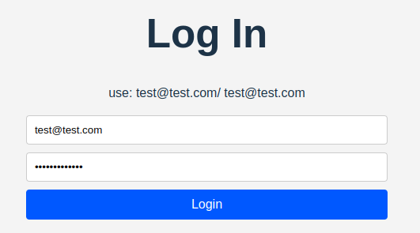
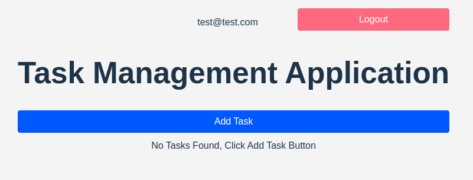
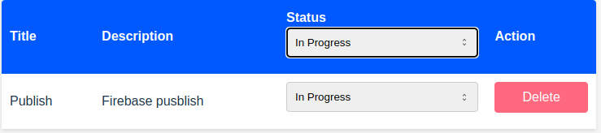

# Task Management App

A simple React-based task management application with Firebase integration for task CRUD operations. Allows users to add, update, and delete tasks, with filtering options by status.

User Details: 
email: test@test.com
password: test@test.com

## Login Page

## Layout

## Add Task

## List Task

## Filter Task

